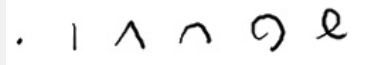
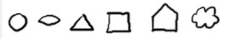
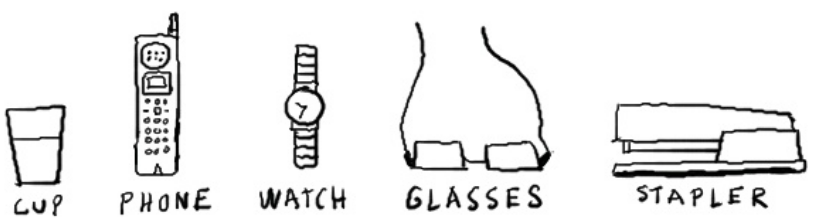

# Patterns facilitation graphique

## ALPHABET VISUEL

Avec une douzaine de formes simples il est possible de dessiner a peu près tout. Ces formes sont les "lettres" de l'alphabet visuel

Les premiers glyphes sont linéaires. Ils peuvent être liés les uns aux autres en séquence ou en chaine. ce sont des formes ouvertes qui se suivent naturellement on les appelle "FLOW". Leurs noms sont POINT, LIGNE, ANGLE, ARC, SPIRALE ET BOUCLE.

Les six autres glyphes sont des formes fermées. Quand une ligne se referme sur elle même elle a tendance a sentir plus comme un objet solide, car les bords de la forme fermé le sépare du fond, comme un ile. 

Les formes fermées sont distinctent de l'environnement qui les entoures, ce qui donne l'illusion d'une forme: on les appelle FORMES

Leurs noms sont OVALES, OEIL, TRIANGLE, RECTANGLE, MAISON ET NUAGE. 

Avec ces douze formes vous pouvez dessiner n'importe quoi. Le nombre de combinaison possible est infini.

Par exemple vous pouvez dessiner toutes les lettre de l'alphabet en utilisant les 12 formes de l'alphabet visuel 12 formes pour dessiner 26 lettres.

## GRANDE METAPHORE VISUELLE

donner le cadre général, en lien avec la thématique. les contenus discutés vont influencer le choix de cette métaphore et seront grandis par celle ci. important de dessiner depuis le debut en disposant les contenus de manière à laisser émerger cette image.

## METAPHORE VISUELLE

Chaque concept doit être expliqué avec une métaphore qui évoque et rend mémorable l'idée (chemin, arbre, bouilloire, ...)

## VOCABULAIRE GRAPHIQUE

nous avons tous une culture différente. Le mot projet par exemple ne sera pas évoqué par la même métaphore visuelle selon la culture du groupe. Interessant de développer un vocabulaire graphique qui nous appartient.

## TEXTE ET SYMBOLE

Associer chaque concept clé à un visuel pour ancrer celui ci.

## SENS DE LECTURE

parfois la facilitation graphique donne de belles choses et on peut entrer par plusieurs chemins, mais on peut aussi être dérouté par cette profusion de contenus. il peut être utile dans certains cas de donner un sens de lecture (par des chiffres, une métaphore visuelle comme un chemin ou une roue) pour faciliter la lecture.

## TITRE

Indique le sujet du dessin. doit se distinguer facilement au premier coup d'oeil. Peut utiliser BANDEAU.

## GESTION DE L'ESPACE

quelles sont les bonnes pratiques ? par où commencer pour nepas se retrouver coincé ? centre ? un coté ?

## CARTE MENTALE

Mettre le sujet au centre, faire ressortir (par encadremenet par exemple). Ajouter branches qui partent du centre, puis sous branches. Différence entre papier et numérique.

## BLANC/VIDE

important de savoir laisser des espace vides, pas seulement pour rajouter de la matière, mais pour que les contenus soient plus visibles, distinguables.

## DEGRÉ D'ECHELLE/FRACTALES

Zoom in / zoom out la métaphore visuelle permet de representer simultanément plusieurs niveaux et de zoomer entre concept, avantage par rapport à coté linéaire.

## CORPS EN BATONNET

schematiser un corps doit être le plus simple possible, battonnets pour les membres, rond ou carré pour la tete, le corps, les pieds, les mains. Dans ce cadre la, les styles peuvent changer selon le facilitateur.

## PERSONNAGES PARLANT

les personnage ont des bulles et s'exprime, à la premiere personne, au pluriel, ils expriment une idée de maniere dynamique.

## VOCABULAIRE EMOTIONNEL

les personnages auront souvent à exprimer des émotions, il est donc essentiel de savoir representer les differentes émotions en deux coups de crayon.

## JOIE
pattern= yeux ouvert, bouche souriante...

## AUTEUR MENTIONNÉ

Trop souvent les travaux de bons auteurs sont diffusés, mais au fur et à mesure des transferts, la source du travail est souvent perdu. Si la source est mentionné dans une page annexe, quand l'image est téléchargé, cette source est de nouveau perdu.

Par conséquent,

Pour profiter au mieux diffusion, mentionner l'auteur dans le dessin avec, si possible le contact. Ainsi si l'image est diffusé, toujours possible de retrouver le contact et d'avoir promotion gratuite.

Un bon dessin sera diffusé et transféré surtout s'il utilise explictement une LICENCE LIBRE. 

## LICENCE LIBRE

Trop souvent les auteurs craignent le piratage et pourtant en même temps ils souhaitent voir leur travail diffusé et le font au cas par cas. Ceci n'empèche en rien des usages non prévus ou autorisés par l'auteur et en même temps certains usagers ne se sentent pas légitime de réutiliser ces contenus.

Par conséquent,

Pour rends diffusable et partageable le travail il est essentiel de mettre un licence libre qui permettra aux usagers de reprendre les contenus dans différents cadres y compris de la formation (qui est un usage commercial). Pour que la licence soit valide et utile il faut un AUTEUR MENTIONNÉ

## SQVID

Dès l'avant-propos, Dan Roam présente le «SQVID», l’outil central du livre qui aide à clarifier, exprimer et représenter les idées. Le «SQVID» est un acronyme dont les lettres correspondent à 5 grandes catégories de questions à se poser pour exprimer une idée visuellement. Cette suite de questions ont pour but de nous aider à identifier les qualités (caractéristiques) des idées recherchées. À noter que ces qualités sont identifiées par des expressions courtes. Vous les trouvez inscrites ici entre les parenthèses à la suite des questions.

Par exemple:

- Pour la lettre S, la question est la suivante: «Voulons-nous une représentation Simple ou complexe de notre idée?» (Simple ou Élaboré)
- Pour la lettre Q, la question est la suivante: «Voulons-nous une représentation Qualitative ou quantitative?» (Qualitatif ou Quantitatif)
- Pour la lettre V, la question est la suivante: «Voulons-nous montrer notre Vision ou la méthode à exécuter pour y parvenir?» (Vision ou Réalisation)
- Pour la lettre I, la question est la suivante: «Voulons-nous montrer les caractéristiques Individuelles de notre idée ou la comparer à autre chose?» (Individualités ou Comparaison)
- Pour la lettre D, la question est la suivante: «Voulons-nous montrer le changement (Delta) ou la situation actuelle?» (Delta - changement ou Statu quo) (Roam, (p.X)

Appliquer systématiquement l'ensemble des questions du SQVID s'avère très efficace pour clarifier un problème complexe, aider à l'expression visuelle d'une idée, préparer, montrer et défendre un argument de façon percutante. 

- http://www.creativite.net/convaincre-en-deux-coups-de-crayon-dan-roam/
- https://prezi.com/-diehedhyh81/convaincre-en-deux-coups-de-crayon/

## ANGLES DU CORPS

La plupart d'entre nous utilisent des personnages en batonnets/ le problème est que dès que l'on passe à quelque chose de plus complexe comme des actions (manger un diner, conduire une voiture, un vélo...). 

Pretez attention au angles du corps. Les angles du corps expriment toute l'attitude du personnage, interessé, interloqué, surpris, ... Pensez à une silhouette vu de loin.

Lorsqu'on dessine un personnage, mieux vaut commencer au niveau du centre de gravité puis évoluer vers l'extérieur.

**Séquence: Torse -> jambes -> bras/mains -> coup/tête -> visage**

Commencez par dessiner un rectangle pour le corps en gardant l'angle du personnage.

La deuxième partie la plus expressive ce sont les jambes. Celles ci relient le personnage au sol et ont un impact très important sur la position du corps. Tracez une ligne pour représenter le sol puis plusieurs traits pour les pieds et les jambes.

Les mains constituent un troisième éléments essentiel à représenter. Essayez de dessiner les bras dans la bonne position. Deux cercles suffisent généralement à représenter les mains.

L'inclinaison de l'angle du cou et de la tête est presque toujours différente par rapport au reste du corps. Essayez de dessiner la tête et de la relier au corps en un seul trait et l'angle adequat.

Maintenant que le corps est tracé vous pouvez vous pencher sur le visage. Vous pouvez faire apparaitre diverse émotions, en modulant l'angle du nez, l'expression des yeux/sourcils, de la bouche, ...

Adapté d'après Gamestorming, Gray, Brown, Macanufo.

## Sources

sources: https://julieboiveau.wordpress.com/category/la-bibliotheque/les-livres-sur-la-facilitation-graphique/

Gamestorming
